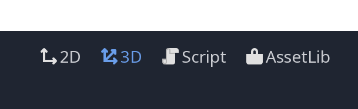
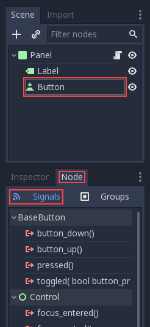
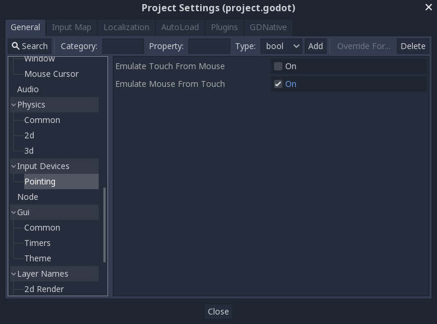
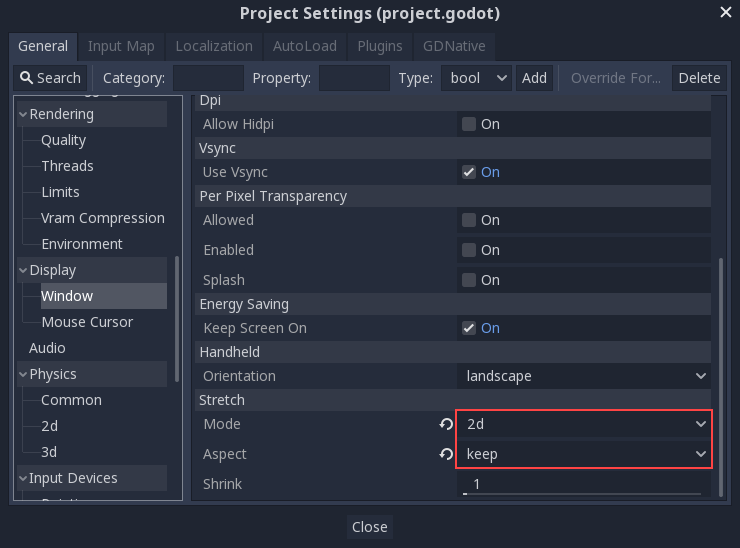

# Godot Notes

-----

LAST UPDATED: 220819

AUTHOR: Jamesong7822

-----

## What is Godot?

<Insert content here >

## GDScript

`*GDScript*` is a high level, dynamically typed programming language used to create content. It uses a syntax similar to [Python](https://en.wikipedia.org/wiki/Python_(programming_language)) (blocks are indent-based and many keywords are similar). Its goal is to be optimized for and tightly integrated with Godot Engine, allowing great flexibility for content creation and integration.

### Comments

Just like `python`, you can comment in `GDScript`using `#`.

```
# This is a comment
```

### Inheritance

To inherit from a file, we use the keyword `extends`. In `python`, the equivalent is `import`

```
extends <CLASS NAME HERE>
```

### Variables

Like `python`, `GDScript`supports dynamic variable types, however, just like `C++`, we do some declaration first, using the keyword `var`.

```
var a = 5
var s = "Hello"
var arr = [1, 2, 3]		# Note: Similar to list!
var dict = {"key": "value", 2: 3}
var typed_var: int
var inferred_type := "String"
```

### Constants

We declare variables with values we do not want to be mutable using the keyword `const`. Similarly, we employ the ALL CAPS  convention of constant variables.

```
const ANSWER = 45
const THE_NAME = "James"
```

### `Enums`

`Enum`is a convenient way to setup a `set` of related constant variables names, that are **automatically assigned incremented integer values starting from 0, unless otherwise assigned (as shown below)**.

```
enum {CONST1, CONST2, CONST3}

# The above line is equivalent to
const CONST1 = 0
const CONST2 = 1
const CONST3 = 2

# However, you can assign different values on assignment
enum {DEFAULT, CUSTOM = 20}

# This line is the same as 
const DEFAULT = 0
const CUSTOM = 20

# You can also create dictionaries using enum
enum State {STATE_IDLE, STATE_PATROL, STATE_ATTACK}

# Same as
const State = {
	STATE_IDLE = 0, 
	STATE_PATROL = 1, 
	STATE_ATTACK = 2
}

# To access enums or dictionaries like the above, we do this:
State.STATE_IDLE
```

### Vectors

Vectors are inbuilt types within `GDScript`.

```
var v2 = Vector2(1, 2)
var v3 = Vector3(1, 2, 3)
```

### Functions

Unlike `python` where we declare functions using `def`, we define functions using the keyword `func` in `GDScript`.

```
func some_function(param1, param2):
	<SOME FUNCTION STUFF HERE>
	
# To specify specific datatypes for params, we can do this:
func my_function(a: int, b: String):
	pass
	
# If a parameter has a default value,
func my_function(int_arg :=42, String_arg: "string"):
	pass
	
# You can also specify the return datatype,
func my_int_function() -> int:
	return 0
```

Unlike in `python`where functions are first class objects, we cannot store functions made in `GDScript`in variables or passed as an argument to another function. However, to do so, we use the following helpers:

```
# call a function by name in one step
<NODE_NAME>.call("<FUNCTION NAME>", args)

# Store a function reference aka in a var
var my_func_ref = funcref(<NODE_NAME>, "<FUNCTION NAME>")

# call store function reference
my_func_ref.call_func(args)
```

### Tokens

`GDScript`has a bunch of reserved keywords (or they call it `tokens`). Here's a table summing up stuff.

| Keyword                                                      | Description                                                  | Keyword                   | Description                                                  |
| ------------------------------------------------------------ | ------------------------------------------------------------ | ------------------------- | ------------------------------------------------------------ |
| `if, elif, else`                                             | Conditional syntax<br />[Ternary](#Ternary) expressions      | `for`                     | Iteration through array                                      |
| `while`                                                      | Loop syntax<br />Use `break` or `continue`                   | `match`                   | Equivalent to `switch`<br />See [match](#match).             |
| `break`                                                      | Exits loops                                                  | `continue`                | Skip to the next iteration of a loop                         |
| `pass`                                                       | Empty functions                                              | `return`                  | Returns a value from a function                              |
| `class`                                                      | Defines a `class`                                            | `extends`                 | Inheritance                                                  |
| `is`                                                         | Tests whether a variable is a given class or given built-in type | `as`                      | Cast the value to a given type if possible                   |
| `self`                                                       | Refer to the current class instance                          | `tool`                    | Executes the script in the editor                            |
| `signal`                                                     | Defines a signal                                             | `static`                  | Defines a static function. Static member variables are not allowed |
| `const`                                                      | Defines a constant                                           | `enum`                    | Defines an [enum](#`enums`)                                  |
| `var`                                                        | Defines a variable                                           | `onready`                 | Initializes a variable once the scene has loaded<br />See [Onready](#Onready) |
| `export`                                                     | Saves a variable along with the resource it is attached to<br />See [export](#export). | `setget`                  | Defines `setter`and `getter`functions<br />See [setter/getter](#Setters/Getters) |
| `breakpoint`                                                 | Editor helper for debugger breakpoints                       | `preload`                 | Preloads a class or variable                                 |
| `yield`                                                      | Coroutine support<br />See [Coroutines with yield](https://docs.godotengine.org/en/3.1/getting_started/scripting/gdscript/gdscript_basics.html#coroutines-with-yield) | `assert`                  | Asserts a condition, logs error on failure.<br />See [assert](#Assert) |
| `remote, master, puppet, remotesync, mastersync, puppetsync` | Networking RPC annotation<br />See [high-level multiplaying docs](https://docs.godotengine.org/en/3.1/tutorials/networking/high_level_multiplayer.html#doc-high-level-multiplayer) | `PI`, `TAU`, `INF`, `NAN` | $\pi$ , $\tau$, $\infin$, Not a number constant (used for comparisons) |

### export

This does what it says, the value of the variable is saved along with the scene resource and is also available for editing in the property editor.

```
export var number = 5 # This number can be edited 
					# and is visible in the property editor
```

There are many reasons why we use `export`but mainly it is to have them visible and editable in the editor.

```
# If the exported value assigns a constant or constant expression,
# the type will be inferred and used in the editor.

export var number = 5

# Export can take a basic data type as an argument, which will be
# used in the editor.

export(int) var number

# Export can also take a resource type to use as a hint.

export(Texture) var character_face
export(PackedScene) var scene_file
# There are many resource types that can be used this way, try e.g.
# the following to list them:
export(Resource) var resource

# Integers and strings hint enumerated values.

# Editor will enumerate as 0, 1 and 2.
export(int, "Warrior", "Magician", "Thief") var character_class
# Editor will enumerate with string names.
export(String, "Rebecca", "Mary", "Leah") var character_name

# Named Enum Values

# Editor will enumerate as THING_1, THING_2, ANOTHER_THING.
enum NamedEnum {THING_1, THING_2, ANOTHER_THING = -1}
export (NamedEnum) var x

# Strings as Paths

# String is a path to a file.
export(String, FILE) var f
# String is a path to a directory.
export(String, DIR) var f
# String is a path to a file, custom filter provided as hint.
export(String, FILE, "*.txt") var f

# Using paths in the global filesystem is also possible,
# but only in tool scripts (see further below).

# String is a path to a PNG file in the global filesystem.
export(String, FILE, GLOBAL, "*.png") var tool_image
# String is a path to a directory in the global filesystem.
export(String, DIR, GLOBAL) var tool_dir

# The MULTILINE setting tells the editor to show a large input
# field for editing over multiple lines.
export(String, MULTILINE) var text

# Limiting editor input ranges

# Allow integer values from 0 to 20.
export(int, 20) var i
# Allow integer values from -10 to 20.
export(int, -10, 20) var j
# Allow floats from -10 to 20, with a step of 0.2.
export(float, -10, 20, 0.2) var k
# Allow values y = exp(x) where y varies between 100 and 1000
# while snapping to steps of 20. The editor will present a
# slider for easily editing the value.
export(float, EXP, 100, 1000, 20) var l

# Floats with Easing Hint

# Display a visual representation of the ease() function
# when editing.
export(float, EASE) var transition_speed

# Colors

# Color given as Red-Green-Blue value
export(Color, RGB) var col # Color is RGB.
# Color given as Red-Green-Blue-Alpha value
export(Color, RGBA) var col # Color is RGBA.

# Another node in the scene can be exported, too.

export(NodePath) var node
```

### Assert

The `assert` keyword can be used to check conditions in debug builds. These assertions are ignored in non-debug builds.

```
# Check that 'i' is 0.
assert(i == 0)
```

### Onready

When using nodes, it’s common to desire to keep references to parts of the scene in a variable. As scenes are only warranted to be configured when entering the active scene tree, the sub-nodes can only be obtained when a call to `Node._ready()` is made.

Instead of this:

```
var my_label

func _ready():
    my_label = get_node("MyLabel")
```

We can do:

```
onready var my_label = get_node("MyLabel")
```

### Setters/Getters

Applied using the `setget`keyword. It is used directly after a variable definition like so:

```
var variable = value setget setterfunc, getterfunc
```

For example:

```
var myvar setget my_var_set, my_var_get

func my_var_set(new_val):
	my_var = new_val
	
func my_var_get():
	return my_var # Getter must always return a value
```

Either of the `setter` or `getter`functions can be omitted.

```
# Only a setter.
var my_var = 5 setget myvar_set
# Only a getter (note the comma).
var my_var = 5 setget ,myvar_get
```

### match

The basic syntax:

```
match [expression]:
	[pattern](s):
		[block]
	[pattern](s):
		[block]
	[pattern](s):
		[block]
```

> **Crash course for people familiar with switch statements**
>
> 1. Replace `switch` with `match`
> 2. Remove `case`
> 3. Remove any `break`s. If you don’t want to `break` by default, you can use `continue` for a fall through.
> 4. Change `default` to a single underscore.

The patterns are matched from top to bottom, and if matched, the corresponding block will be executed. After that, the execution continues below the `match`statement. We can use `continue`to stop execution in the current block and check the ones below it.

There are 6 pattern types:

#### Constant Pattern

Constant primitives, like `numbers` or `strings`

```
match x:
	1: 
		print ("This is one")
	2: 
		print ("This is two")
	"test":
		print ("This is 'test'")
```

#### Variable Pattern

Matches the type of a variable or `enum`

```
match typeof(x):
	TYPE_REAL:
		print ("Real")
	TYPE_STRING:
		print ("String")
	TYPE_ARRAY:
		print ("Array")
```

#### Wildcard Pattern

This pattern matches everything. It's written as a single underscore or `_`. It is the equivalent of a `default` in a `switch` statement in other languages.

```
match x:
	1: 
		print ("This is one")
	2: 
		print ("This is two")
	_:
		print ("Not 1 or 2. Don't really care")
```

#### Binding Pattern 

This introduces a new variable, and matches everything while also giving that value a variable name. This is useful in array and dictionary patterns.

```
match x:
	1: 
		print ("This is one")
	2: 
		print ("This is two")
	var new_var:
		print ("It's not 1 or 2, it's ", new_var)
```

#### Array Pattern

Matches an array. Every single element of the array pattern is a pattern itself, so you can nest them. **Length of the array** is tested first, and it has to be same size as the pattern, otherwise, the pattern does not match.

**Open-ended array**: An array can be bigger than the pattern by making the last sub-pattern `..`. Each sub-pattern has to be comma separated.

```
match x:
	[]:
		print ("Empty Array")
	[1, 3, "test", null]:
		print ("Specific Array")
	[var start, _, "test"]:
		print ("First element is ", start, ", and the last is \"test\"")
	[42, ..]:
		print ("Open ended array")
```

#### Dictionary Pattern

Similar to the [Array Pattern](#Array Pattern). Every key has to be a constant pattern. Similarly, the size of the dictionary is tested first and must be same size as the pattern, otherwise the pattern does not match.

**Open-ended dictionary**: A dictionary can be bigger than the pattern by making the last sub-pattern `..`. Every sub-pattern must be comma separated.

If a value is not specified, only the existence of the key is checked. A value pattern is separated from the key pattern with a `:`.

```
match x:
	{}:
		print ("Empty dictionary")
	{"name": "James"}:
		print ("The name is James")
	{"name": "James", "age": var age}:
		print ("James is ", age, " years old")
	{"name", "age"}:
		print ("Dictionary has keys 'name' and 'age'.")
	{"key": "blah blah", ..}:
		print ("I only checked for one entry and ignored the rest!!")
```

#### Multi-Patterns

You can also specify multiple patterns by separating them with a comma. **These patterns are not allowed to have any bindings in them**.

```
match x:
	1, 2, 3:
		print ("It's 1 - 3")
	"Sword", "Splash potion, "Fist":
		print ("Yeapsie, you have taken some damage!")
```


#### 

### Ternary

Sometimes, ternary-if expressions may come in handy:

```
var x = [value] if [conditional expression] else [value]

# Example
y += 3 if y < 10 else -1
```


## Useful Shortcuts

### Accessing tabs

Opening up the Godot game engine editor, you will see four tabs: '2D', '3D', 'Script' and 'Asset Lib'.



To access the tabs without clicking on them individually, use the following keys:

| Key  | Tab        |
| ---- | ---------- |
| `F1` | `2D`       |
| `F2` | `3D`       |
| `F3` | `Script`   |
| `F4` | `AssetLib` |

### Adding Child Nodes

Adding child nodes can be done in the `scene` tab by clicking the `+`button or by using the keyboard shortcut `Ctrl+A`.

### Zoom Fit 

Select items to zoom fit on (fit viewport) and press `shift + f`.

## Signals

Signals are “emitted” when some specific kind of action happens, and they can be connected to any function of any script instance. Signals are used mostly in GUI nodes, although other nodes have them too, and you can even define custom signals in your own scripts.

Signals are a way to *decouple* your game objects, which leads to better organized and more manageable code. Instead of forcing game objects to expect other objects to always be present, they can instead emit signals that all interested objects can subscribe to and respond to.

### Binding using game editor

You can bind a signal to any node by clicking the `node`tab and make sure `signals`is selected.



### Binding using script

We can use the inbuilt function `get_node()`to select the particular child node beneath our parent node. For example,

```
func _ready():
	get_node(<NODE NAME HERE>)
	
	# The following shorthand works too
	$<NODE>
```

Next, we can write the function to be called,

```python
func <FUNCTION NAME HERE>():
	<DO FUNCTION HERE>
```

Finally, we connect the desired `signal`as follows:

```
func _ready():
	get_node(<NODE NAME HERE>).connect(`signal`, self, <FUNCTION NAME HERE>)
```

We can define our own signals using:

```
signal <SIGNAL NAME>

# Even give it arguments
signal <SIGNAL NAME>(p1, p2) # However, this means defined function in above connect
                             # must also match the number of arguments
```

Here's an example of binding a `Button Pressed` signal:

```
func _ready():
    get_node("Button").connect("pressed", self, "_on_Button_pressed")

func _on_Button_pressed():
    get_node("Label").text = "HELLO!"
```

### Custom Signals

You can declare custom signals in Godot:

```
signal my_signal
```

Once declared, this custom signal will appear in the inspector and can be connected in the same way as a node's built-in signals. 

### Connecting Signals (Code)

You can also connect signals via code. This is especially useful if you create multiple instances of an object.

For example, 

```
func _ready():
	connect("my_signal", self, "_on_Timer_my_signal")
```

Whereby the **first** argument is the name of the signal, the **second** is the target and the **third** is the method, that will get called. If you want to make the connection **Oneshot** or **Deferred**, you can do this like so:

```
connect("my_signal", self, "_on_Timer_my_signal", [], CONNECT_DEFERRED | CONNECT_ONESHOT)
```

### Disconnecting Signals 

You can disconnect connected signals by using the editor. Just go to the **Signals Tab**, select the signal and click on **Disconnect**.

Or you can also disconnect signals with the following line of code:

```
disconnect("my_signal", self, "_on_my_signal")
```


### Emitting SignalsF

To emit a signal via code, we call the `emit_signal()`function:

```
func _ready():
	emit_signal("<SIGNAL NAME>")
```

Many of Godot’s built-in node types provide signals you can use to detect events. For example, an [Area2D](https://docs.godotengine.org/en/3.1/classes/class_area2d.html#class-area2d) representing a coin emits a `body_entered` signal whenever the player’s physics body enters its collision shape, allowing you to know when the player collected it.

## Processing

Godot engine requires a script to be processed on every frame. There are 2 such types of processing: `idle processing`and `physics processing`.

### **Idle Processing**

This is activated whenever the method `Node._process()`is found in a script. It can be turned on and off with the `Node.set_process()`function.

```
func _process(delta):
	# Do stuff here...
	pass
```

It’s important to bear in mind that the frequency with which `_process()` will be called depends on how many frames per second (FPS) your application is running at. This rate can vary over time and devices.

To help manage this variability the `delta` parameter contains the time elapsed in seconds, as a floating point, since the previous call to `_process()`.

This parameter can be used to make sure things always take the same amount of time, regardless of the game’s FPS.

For example, movement is often multiplied with a time `delta`to make movement speed both constant and independent from frame rate.

A simple way to see how `_process()`works is to use a single `Label`node.

```
extends Label

var accum = 0

func _process(delta):
	accum += delta
	text = str(accum)  # text is a built in Label property
```

### **Physics Processing**

Physics processing with `_physics_process()` is similar, but it should be used for processes that must happen before each physics step, such as controlling a character. It always runs before a physics step and it is called at fixed time intervals: 60 times per second by default. You can change the interval from the Project Settings, under Physics -> Common -> Physics Fps.

The function `_process()`, however, is not synced with physics. Its frame rate is not constant and is dependent on hardware and game optimization. Its execution is done after the physics step on single-threaded games.

## Groups

Groups in Godot work like tags you might have come across in other software. A node can be added to as many groups as desired. This is a useful feature for organizing large scenes. More regarding the `SceneTree`class can be read up [here](https://docs.godotengine.org/en/3.1/classes/class_scenetree.html#class-scenetree).

### Adding Nodes To Groups

There are two ways to add nodes to groups. The first is from the UI, using the Groups button under the Node panel:


The second way is to add using `GDScript`.

```
func _ready():
	add_to_group("<GROUP NAME HERE>")
```

### Calling Functions For Grouped Nodes

We use `SceneTree.call_group()`:

```
func <FUNC NAME>():
	get_tree().call_group("<GROUP NAME>", "<FUNCTION TO CALL>")
```

### Getting All Nodes In Group

We can get the full list of `nodes` in a group by calling `SceneTree.get_nodes_in_group()`:

```
var <VARIABLE NAME> = get_tree().get_nodes_in_group("<GROUP NAME>")
```

## Creating New Nodes

To create a new node from code, we call the `.new()`method. For example,

```
var s
func _ready():
	s = Sprite.new() # Create a new sprite!
	add_child(s) # Important! This adds it as a child of this node
```

## Deleting Nodes

To delete a node, we call `.free()`.

```
func <SOME FUNC>():
	s.free() # Immediately removes node from the scene and frees it
```

When a node is freed, it also frees all its child nodes. Because of this, manually deleting nodes is much simpler than it appears. Free the base node and everything else in the subtree goes away with it.

However, if the node is still being used, this might caused the game to crash unless the debugger catches it. So, the convention and recommended way to remove a node is to call `.queue_free()`

```
func <SOME OTHER FUNC>():
	s.queue_free() # Removes node from the scene and frees it when it is safe to do so
```

## Instancing Scenes

Instancing a scene from code is done in two steps. The first one is to load the scene:

```
var scene = load("res://<PATH TO SCENE>.tscn")
```

Preloading the scene file can be more convenient as it happens during parse time. However, this is only available using GDScript only.

```
var scene = preload("res://<PATH TO SCENE>.tscn")
```

However a scene is still not a node, but packaged inside a special resource called [PackedScene](https://docs.godotengine.org/en/3.1/classes/class_packedscene.html#class-packedscene). To create the actual node, we call `PackedScene.instance()`. This returns the tree of nodes that can be added later to the active scene:

```
var node = scene.instance()
add_child(node)
```

The advantage of this two-step process is that a packed scene may be kept loaded and ready to use so that you can create as many instances as desired. This is especially useful to quickly instance several enemies, bullets, and other entities in the active scene.


## Useful Classes Or Functions

### `RandomNumberGenerator`

There is an inbuilt class `RandomNumberGenerator`that has the ability to generate pseudo-random numbers. It uses [PCG32](http://www.pcg-random.org/)

#### **Properties**

`seed` : `int`

The seed used by the random number generator. A given seed will give a reproducible sequence of pseudo-random numbers.

We can use the following:

`setter`: `set_seed(value)`

`getter`: `get_seed(value)`

to set or retrieve the current seed value.

#### Methods

`randf()`

> Generates pseudo-random float between `0.0`to `1.0`, inclusive

`randf_range(float from, float to)`

> Generates pseudo-random float between `from`and `to`, inclusive

`randfn(float mean=0.0, float deviation=1.0)`

> Generates normally(gaussian) distributed pseudo-random number, using Box-Muller transform with the specified `mean` and a standard `deviation`.

`randi()`

>Generates pseudo-random 32-bit unsigned integer between ‘0’ and ‘4294967295’, inclusive.

`randi_range(int from, int to)`

> Generates pseudo-random 32-bit signed integer between `from` and `to` (inclusive).

`randomize()`

> Setups a time-based seed to generator

#### Example

To generate a random float number (within a given range) based on a time-dependent seed:

```
var rng = RandomNumberGenerator.new()
func _ready():
	rng.randomize()
	var my_random_number = rng.randf_range(<LOWER BOUND>, <UPPER BOUND>)
```

Or to generate a random integer between `0` and `n-1`:

```
var my_random_integer = rng.randi() % n
```

### Get Keypresses

We can use the `_process()` function to define what the player will do. `_process()` is called every frame, so we’ll use it to update elements of our game, which we expect will change often. For the player, we need to do the following:

- Check for input.
- Move in the given direction.
- Play the appropriate animation.

You can detect whether a key is pressed using `Input.is_action_pressed()`, which returns `true` if it is pressed or `false` if it isn’t.

```
func _process(delta):
    var velocity = Vector2()  # The player's movement vector.
    if Input.is_action_pressed("ui_right"):
        velocity.x += 1
    if Input.is_action_pressed("ui_left"):
        velocity.x -= 1
    if Input.is_action_pressed("ui_down"):
        velocity.y += 1
    if Input.is_action_pressed("ui_up"):
        velocity.y -= 1
    if velocity.length() > 0:
        velocity = velocity.normalized() * speed
        $AnimatedSprite.play()
    else:
        $AnimatedSprite.stop()
```

The following example assumes a node `AnimatedSprite`is present.

### Restricting Values

There is a handy function for restricting values and that is the `clamp()`function.

For example, (under the `_process(delta)`)

```
pos += velocity * delta
pos.x = clamp(position.x, 0, screen_size.x)
pos.y = clamp(position.y, 0, screen_size.y)
```

We can get the `screen_size` by calling `get_viewport_rect().size` . Read more [here](#Getting Screen Size)

### Getting Screen Size

There is a handy function for this: `get_viewport_rect().size`. This returns a tuple in the form of `width` and `height`.

### Getting Mouse Position

```
func _input(event):
   # Mouse in viewport coordinates
   if event is InputEventMouseButton:
       print("Mouse Click/Unclick at: ", event.position)
   elif event is InputEventMouseMotion:
       print("Mouse Motion at: ", event.position)

   # Print the size of the viewport
   print("Viewport Resolution is: ", get_viewport_rect().size)
```

We can also call `get_viewport().get_mouse_position()`


### Hiding The Sprite

Hiding the sprite from view is really easy and can be done by simply calling the `hide()`method.

### Deferring Properties

Sometimes there may be an error in the game engine when we switch or change node properties while a process is still ongoing. In the event that this happens, we can call `set_deferred(<PROPERTY NAME>, BOOL)` to set the property when it is safe to do so.

For example, to disable a `CollisionShape2D`'s area collision shape, 

```
$CollisionShape2D.set_deferred("disabled", true)
```

## Exporting

Now that you have a working game, you probably want to share your success with others. However, it’s not practical to ask your friends to download Godot just so they can open your project. Instead, you can *export* your project, converting it into a “package” that can be run by anyone.

The way you export your game depends on what platform you are targeting. In this tutorial, you’ll learn how to export the “Dodge the Creeps” game for a variety of platforms. First, however, we need to make some changes to the way the game works.

### Touch Or Mouse?

By default Godot emulates mouse input from touch input. That means if anything is coded to happen on a mouse event, touch will trigger it as well. If you wish to disable that for whatever reason, or emulate touch from mouse input, you can do that in the “Project Settings” under *Input Devices* and *Pointing*



### Screen Scaling

To ensure the game scales consistently on different sized screens, we can head down to `Display` > `Window` settings and under the `stretch`options set `Mode`to "2d" and set `Aspect`to "keep".



For platform specific exports please visit this [link](https://docs.godotengine.org/en/3.1/getting_started/step_by_step/exporting.html) for more information.